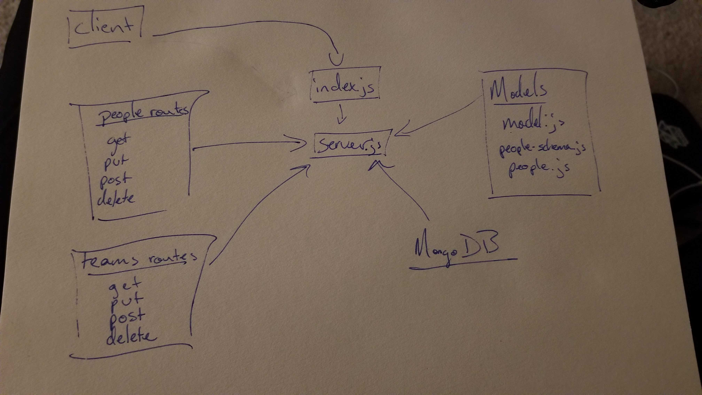

# LAB - 08

### Author: Morgan T Shaw

### Links and Resources
* [submission PR](https://github.com/morgan-401-advanced-javascript/lab08/pull/1)
* [travis](https://travis-ci.com/morgan-401-advanced-javascript/lab08)
* [back-end](http://xyz.com) (when applicable)
* [front-end](http://xyz.com) (when applicable)

#### Documentation
* [api docs](http://xyz.com) (API servers)
* [jsdoc](http://xyz.com) (Server assignments)

### Modules
#### `modulename.js`
##### Exported Values and Methods

###### `foo(thing) -> string`
Usage Notes or examples

###### `bar(array) -> array`
Usage Notes or examples

### Setup
#### `.env` requirements
* `PORT` - 3000
* `MONGODB_URI` - URL to the running mongo instance/db

#### Running the app
* `npm start`
  
#### Tests
* How do you run tests?
npm test

#### UML
